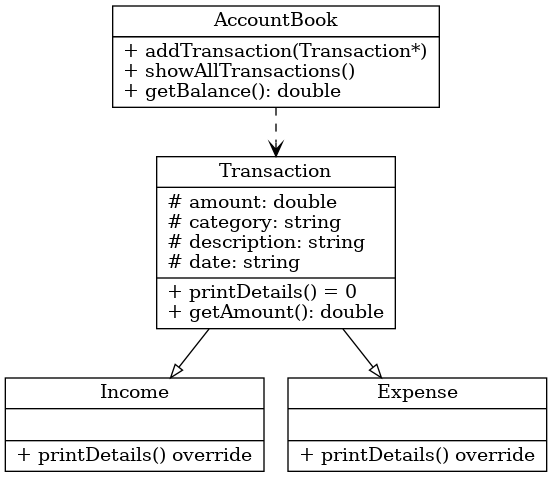

#   小組專題:記帳程式

---

##  基本資訊

- **組別**：第16組  
- **系級班級**：資工1B  
- **成員**：
  - 羅予岑
  - 陳以哲
  - 鄭宇紘  

---

##  專題內容

### 專案說明

CloudJudge 是一款使用 C++ 撰寫的記帳程式，具備物件導向設計，支援管理日常收支，包括收入與支出記錄、分類統計。

---

###  功能規範

1. 新增收入或支出記錄
2. 每筆記錄包含：
   - 金額
   - 分類
   - 日期
   - 備註
3. 支援查詢月報表與分類統計
4. 所有功能透過選單操作，簡單直觀

---

###  程式介紹（檔案與類別設計）

####  程式檔案說明

| 檔案名稱          | 功能簡介 |
|-------------------|-----------|
| `main.cpp`        | 主程式，負責使用者介面與功能控制流程 |
| `Transaction.h` / `Transaction.cpp` | 抽象類別，定義收入與支出的共同屬性與方法 |
| `Income.h` / `Income.cpp` | 定義收入類別，繼承自 Transaction |
| `Expense.h` / `Expense.cpp` | 定義支出類別，繼承自 Transaction |
| `Record.h` / `Record.cpp` | 封裝單筆記錄的儲存、顯示功能 |
| `AccountBook.h` / `AccountBook.cpp` | 總帳本，儲存所有記錄，負責新增記帳與統計報表 |

---

#### UML 類別圖

說明:類別設計：
Record:

負責儲存單筆記帳資料（收入/支出、金額、分類、日期、備註）

Ledger:

管理多筆記帳資料、提供新增、查詢與統計功能

App:

負責整體程式流程控制與與使用者互動

---
### 流程圖:

### 流程說明：

顯示主選單->根據使用者輸入執行對應功能->執行新增 / 查詢 / 統計等操作->回到主選單或結束程式

---

## 操作方式

執行程式後，系統將顯示以下選單：

新增記帳:

顯示所有記錄:

類別統計報表:

離開:

根據輸入選項完成收支紀錄、查詢與統計功能。

---

## 程式安裝與執行方式

### 系統需求

- 支援 C++11 的編譯器（如 g++, Visual Studio 等）

##畫面截圖

menu.png：主選單畫面

input_record.png：新增記帳畫面

report.png：月份報表畫面

summary.png：分類統計畫面

g++ main.cpp AccountBook.cpp Expense.cpp Income.cpp Record.cpp Transaction.cpp -o cloudjudge

| 成員  | 工作內容                                  |
| --- | ------------------------------------- |
| 羅予岑 | 設計主程式、 PPT 製作、流程圖繪製        |
| 陳以哲 | 記帳資料處理邏輯、介面互動、  GitHub 管理                 |
| 鄭宇紘 | 初步流程概念及邏輯構思、UML 製作、上台報告 |

